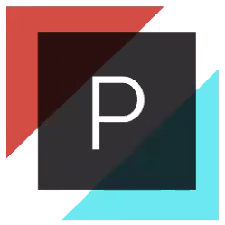
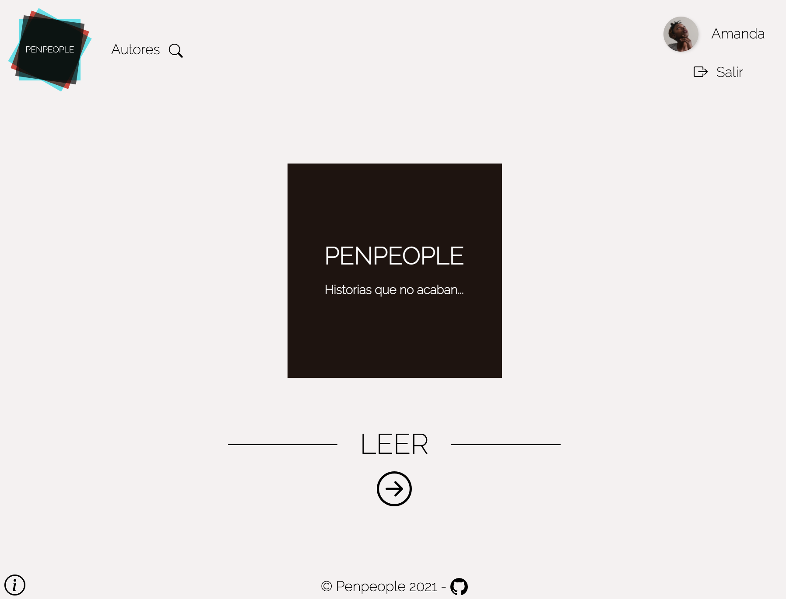
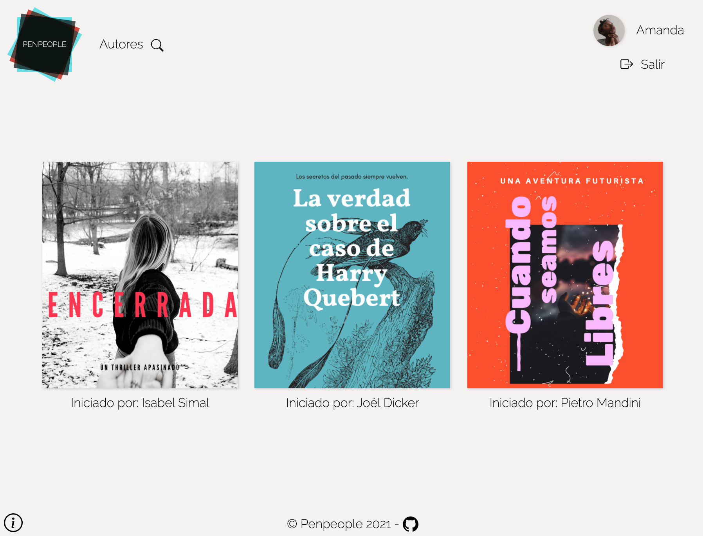
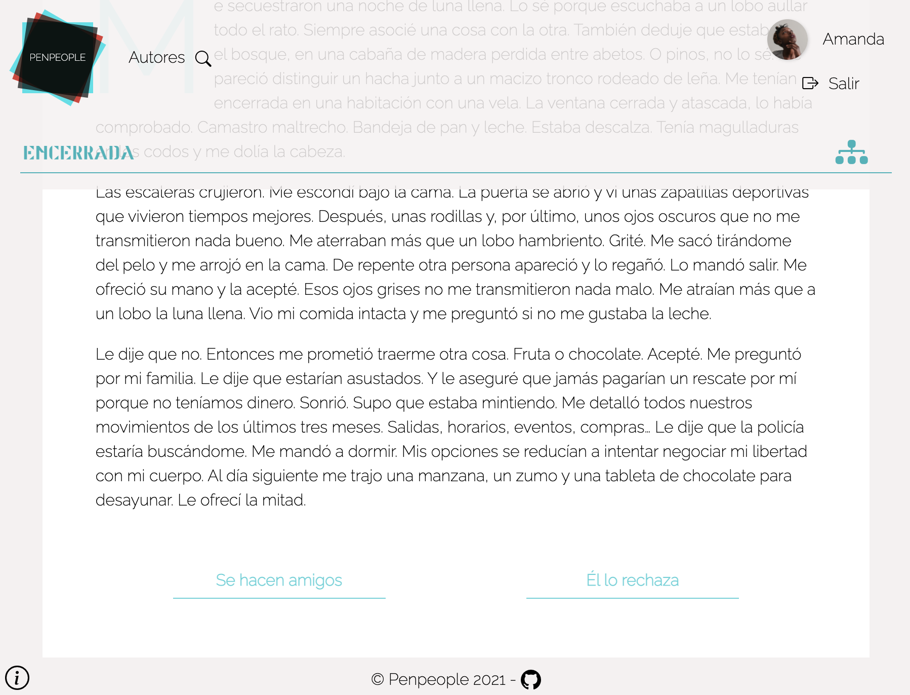
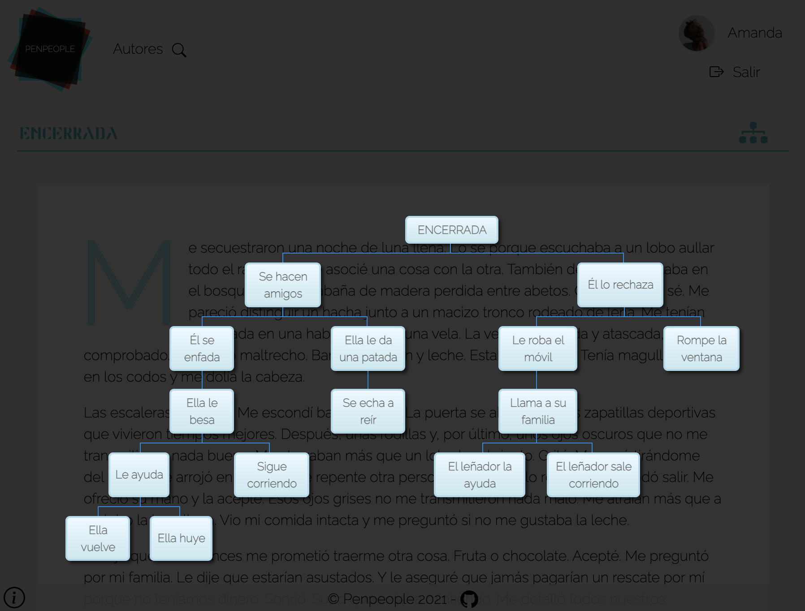

# Penpeople

<p align="center">

</p>

Penpeople es una plataforma dirigida a escritores con el objetivo de escribir historias de manera colaborativa. 
Esto va formando un árbol de decisiones que ofrece múltiples ramas argumentales sobre una misma historia ofreciendo una experiencia de lectura y excritura interactiva.
#
<p align=center>


</p>
<p align=center>


</p>

## Descripción

* Diseño responsive (Ordenador, tablet y móvil)
* CRUD de usuarios, historias y bloques
* Creación y edicción de contenido
* Editor de texto (TinyMCE)
* Carga de imágenes
* Árbol de decisiones con Google Chart adaptado a Vue Composition API
* Envío correos (Node Mailer + Handlebars)

## Stack

* HTML5, CSS3, JS
* SASS
* [VueJS](https://vuejs.org/)
* [Node.js](https://nodejs.org/es/)
* [Express.js](https://expressjs.com/es/)
* [Bcrypt](https://www.npmjs.com/package/bcrypt)
* [Nodemailer](https://nodemailer.com/about/)
* [Nodemailer-express-handlebars](https://www.npmjs.com/package/nodemailer-express-handlebars)
* [MongoDB Atlas](https://www.mongodb.com/es)
* [Mongoose](https://mongoosejs.com/)

## Project setup
```
npm install
```

### Frontend:

```
npm run serve
```

### Backend:

```
npm start
```

## Equipo

<a href="https://github.com/charimat" target="_blank">

</a>
<a href="https://github.com/rosepernia" target="_blank">

</a>
<a href="https://github.com/Martasanch" target="_blank">

</a>
<a href="https://github.com/DvM94" target="_blank">

</a>
